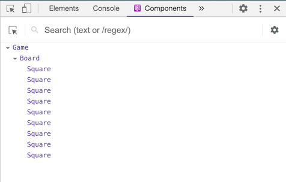
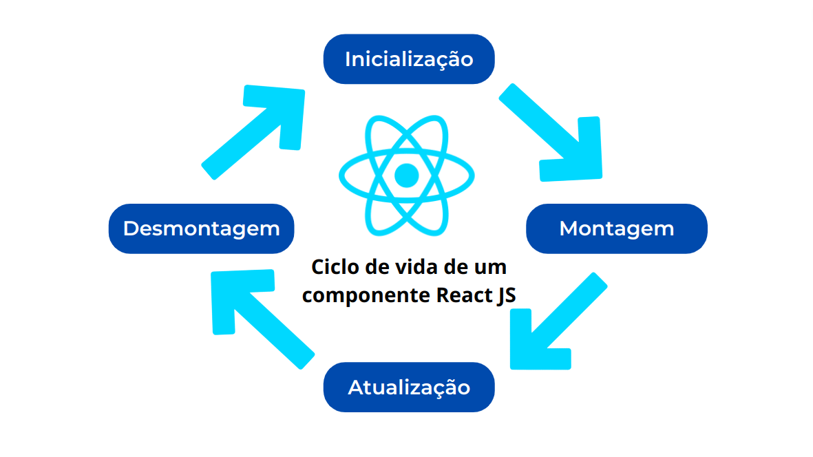

<p align="center">
    <br>
    
</p>

## Desenvolvedor Frontend - React 

Repositório de exemplo feitos em aulas na turma 02 do projeto MouraTech (Parceria IFPE - Moura - FADE) 
para implementação do [Tutorial: Introdução ao React](https://pt-br.reactjs.org/tutorial/tutorial.html).

> Vamos construir um pequeno jogo durante este tutorial. Você pode ficar tentado a ignorá-lo porque você não vai construir jogos - mas dê uma chance. As técnicas que você aprenderá no tutorial são fundamentais para criar qualquer aplicativo React e o domínio delas lhe dará um profundo entendimento de React.

<table>
  <thead>
    <tr>
      <th>Etapa</th>
      <th>Descrição</th>
      <th>Commit</th>
    </tr>
  </thead>
  <tbody>
    <tr>
      <td>00</td>
      <td>
        Aplicação React criada usando Create React App<br>
        <code>
          npx create-react-app tutorial-react
        </code>
      </td>
      <td>
        <a target="_self" href="https://github.com/jobsontn/tutorialReact/commit/761fc7536e7eb9d1227cd0158d8983c58dfe283b">761fc75</a>
      </td>
    </tr>
    <tr>
      <td>01</td>
      <td>
        Passo 1 - Código Inicial / Mock
      </td>
      <td>
        <a target="_self" href="https://github.com/jobsontn/tutorialReact/commit/45d4739995f3587369297c1fb3c45946787c0ae8">45d4739</a>
      </td>
    </tr>
    <tr>
      <td>02</td>
      <td>
        Passo 2 - Passando dados através de props
      </td>
      <td>
        <a target="_self" href="https://github.com/jobsontn/tutorialReact/commit/62f7a6569c32775c8cbdff6acfb9c8bfc0bea20a">62f7a65</a>
      </td>
    </tr> 
    <tr>
      <td>03</td>
      <td>
        Passo 3 - Fazendo um componente interativo
      </td>
      <td>
        <a target="_self" href="https://github.com/jobsontn/tutorialReact/commit/cd40f53ee155b71e4ed0fab453b3791e7045a1ac">cd40f53</a>
      </td>
    </tr> 
    <tr>
      <td>04</td>
      <td>
        Passo 4 - Movendo o state para cima (Square -> Board)
      </td>
      <td>
        <a target="_self" href="https://github.com/jobsontn/tutorialReact/commit/f1b18dbf8456aea4058b36af94709edbb21a34af">f1b18db</a>
      </td>
    </tr> 
    <tr>
      <td>05</td>
      <td>
        Passo 5 - Mudar o Square para ser um componente de função
      </td>
      <td>
        <a target="_self" href="https://github.com/jobsontn/tutorialReact/commit/2bee98018796a3eba39c66b97a2e26d6ee6b5e4d">2bee980</a>
      </td>
    </tr> 
    <tr>
      <td>06</td>
      <td>
        Passo 6 - Trocando Turnos
      </td>
      <td>
        <a target="_self" href="https://github.com/jobsontn/tutorialReact/commit/ba49aa1baa3b3c736031c8b18c06ea9b68d1b4e0">ba49aa1</a>
      </td>
    </tr>
    <tr>
      <td>07</td>
      <td>
        Passo 7 - Declarando um Vencedor
      </td>
      <td>
        <a target="_self" href="https://github.com/jobsontn/tutorialReact/commit/489009e3cf83d9b16125f960e827d3119a5951fa">489009e</a>
      </td>
    </tr> 
    <tr>
      <td>08</td>
      <td>
        Passo 8 - Trazendo o State pra Cima, Novamente (Board -> Game)
      </td>
      <td>
        <a target="_self" href="https://github.com/jobsontn/tutorialReact/commit/54047095d6cc45fd5face30c7b4c1ea236e58de2">5404709</a>
      </td>
    </tr> 
    <tr>
      <td>09</td>
      <td>
        Passo 9 - Mostrando as Jogadas Anteriores
      </td>
      <td>
        <a target="_self" href="https://github.com/jobsontn/tutorialReact/commit/8f1f1eca20b5d132a53b2d143d248b32e37d95ce">8f1f1ec</a>
      </td>
    </tr> 
    <tr>
      <td>10</td>
      <td>
        Passo 10 - Implementando a Viagem no Tempo (Time Travel)
      </td>
      <td>
        <a target="_self" href="https://github.com/jobsontn/tutorialReact/commit/5116bfa9b990303c62de58b651c57799b426f367">5116bfa</a>
      </td>
    </tr> 
  </tbody>
<table>

# Conceitos

## O que é React

O React é uma biblioteca JavaScript declarativa, eficiente e flexível para criar interfaces com o usuário. Ele permite compor UIs complexas a partir de pequenos e isolados códigos chamados “componentes”.

## Componentes de Função e Classe

**Componente de Função** - A maneira mais simples de definir um componente é escrever uma função JavaScript.

**Componente de Classe** - Você também pode usar uma classe ES6 para definir um componente.

## Propriedades (props)

Os componentes do React usam **props** para se comunicarem uns com os outros. Cada componente pai pode passar algumas informações para seus componentes filhos, dando-lhes props. Props podem lembrá-lo de atributos HTML, mas você pode passar qualquer valor JavaScript por meio deles, incluindo objetos, arrays, funções e até mesmo JSX!

## Estado (state)

Os componentes geralmente precisam alterar o que está na tela como resultado de uma interação. Digitar no formulário deve atualizar o campo de entrada, clicar em “próximo” em um carrossel de imagens deve alterar qual imagem é exibida, clicar em “comprar” deve colocar um produto no carrinho de compras. Os componentes precisam “lembrar” coisas: o valor de entrada atual, a imagem atual, o carrinho de compras. No React, esse tipo de memória específica do componente é chamada de estado .

**Observação:** O Estado é isolado e privado.

### Para adicionar uma variável de estado em um componente de função:
1. Importe useStatedo React na parte superior do arquivo:
   ```javascript
   import { useState } from 'react';
   ```
2. Use o Hook useState que retorna um array contendo: variálvel do estado e função para alterar o estado. 
   O Hook useState recebe como parametro o valor inicial do estado.
   ```javascript
   const [index, setIndex] = useState(0);
   ```
> No React, useState, assim como qualquer outra função que comece com ” use”, é chamada de Hook.
> 
> Hooks são funções especiais que estão disponíveis apenas enquanto o React está renderizando. Eles permitem que você “se conecte” a diferentes recursos do React.
>
> O estado é apenas um desses recursos, mas você conhecerá os outros Hooks (Ganchos) mais tarde.

### Para adicionar uma variável de estado em um componente de classe:
1. O atributo state deve ser criado no construtor da classe e de receber um objeto javascript com o estado inicial do componente.
   ```javascript
    constructor(props) {
        super(props);
        this.state = {
            index: 0,
        };
    }
   ```
2. Não Modifique o State Diretamente. Em vez disso, use o método setState para alterar o estado do componente. Atualizações de State São Mescladas.
   ```javascript
   this.setState({ index: 5 });
   ```

## Developer Tools

A extensão React Devtools para [Chrome](https://chrome.google.com/webstore/detail/react-developer-tools/fmkadmapgofadopljbjfkapdkoienihi?hl=en) 
e [Firefox](https://addons.mozilla.org/en-US/firefox/addon/react-devtools/) permite inspecionar uma árvore de componentes React com as ferramentas de desenvolvedor do seu navegador.

<p align="center">
    
</p>

O React DevTools permite que você verifique as props e o estado (state) de seus componentes React.

## Ciclo de Vida do componente

<p align="center">
    
</p>

 Em um componente de função controlamos o ciclo de vida do componente React usando o Hook **useEffect** enquanto em um componente de classe 
 controlamos o ciclo de vida do componente React por meio dos métodos **componentDidMount**, **componentDidUpdate** e **componentWillUnmount**.

 ## Movendo o state para cima / Elevar o state

 Com frequência, a modificação de um dado tem que ser refletida em vários componentes. A documentação do React recomenda elevar o state compartilhado ao elemento pai comum mais próximo.

No React, o compartilhamento do state é alcançado ao movê-lo para o elemento pai comum aos componentes que precisam dele. Isso se chama “elevar o state” (state lift).

> Elevar o state envolve escrever mais código de estrutura do que as abordagens de two-way data bind, mas como benefício, demanda menos trabalho para encontrar e isolar erros. Já que o state “vive” em um componente e somente esse componente pode alterá-lo, a área de superfície para encontrar os erros é drasticamente reduzida.

Se após elevar o **state** o componete não manter mais **state** e apenas receber dados, por meio de **props**, do componente pai, dizemos que este é um componente controlado (controlled components).

## Imutabilidade 

Geralmente existem duas maneiras de se alterar dados. A primeira é mutar o dado alterando diretamente seu valor. A segunda maneira é substituir o dado antigo por uma nova cópia com as alterações desejadas.

### Mudando dados com mutação

```javascript
var player = {score: 1, name: 'Jeff'};
player.score = 2;
// Agora o player é {score: 2, name: 'Jeff'}
```

### Mudando dados sem mutação

```javascript
var player = {score: 1, name: 'Jeff'};
var newPlayer = {...player, score: 2};
// Agora o player continua sendo {score: 1, name: 'Jeff'}
// E o newPlayer é {score: 2, name: 'Jeff'}
```

Esse princínpio da Imutabilidade fornerce vários benefícios, que não são de fácil compreensão por iniciantes, como:

1. Complexidade das features se tornam mais simples - uma habilidade de desfazer e refazer certas ações é um requisito comum em aplicações. Evitar mutação nos permite manter o histórico e reutiliza-lo mais tarde.
2. Detectar Mudanças - Detectar mudanças e objetos mutados é difícil, pois, eles são modificados diretamente. Essa detecção requer um objeto mutado para ser comparado com as cópias das suas próprias versões anteriores e a árvore inteira do object para ser cruzada.
3. Determinar Quando Re-renderizar no React - O principal benefício da imutabilidade é que ela ajuda a construir componentes puros em React. Dados imutáveis podem facilmente determinar se foram feitas mudanças, que ajudarão a decidir quando um componente precisa ser re-renderizado.
